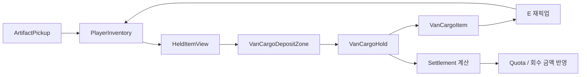

# Design Document

## 개요

이번 설계의 핵심은 “아이템을 값으로 입금하는 기능”을 “밴 내부에 실제 물건을 싣는 기능”으로 바꾸는 것이다. 플레이어는 종가에서 물건을 들고 귀환 밴에 돌아와 `G`로 적재하고, 손이 비면 다시 종가로 들어가 더 큰 위험을 감수할 수 있다. 정산은 숫자 상태가 아니라 밴 내부에 실제로 남아 있는 물리 회수품을 기준으로 처리한다.

## 현재 문제

- `VanCargoDepositZone`은 현재 `GameLoopController.ExtractPlayerInventory()`를 호출해 손의 물건을 바로 `PendingRecoveredValue`로 바꾼다.
- 이 방식은 적재된 물건이 밴 안에 보이지 않고, 다시 집어 들 수도 없다.
- 플레이어 입장에서는 “물건을 싣고 다시 내려가 더 가져온다”는 핵심 판단이 사라진다.
- 정산 대상이 밴 내부 물건이 아니라 숫자 상태라서, 리썰 컴퍼니식 흐름과 다르게 느껴진다.

## 목표 구조

## 컴포넌트 설계

### `VanCargoHold`

밴 내부의 물리 적재 상태를 소유하는 컴포넌트다.

- 밴 내부 적재 영역의 루트 오브젝트에 붙는다.
- 적재 슬롯 Transform 목록을 가진다.
- 현재 실린 `VanCargoItem` 목록을 가진다.
- 정산 가능한 총 가치와 아이템 개수를 계산한다.
- 정산 완료 시 cargo item을 제거한다.
- 밴 밖에 있는 드롭 아이템은 계산하지 않는다.

### `VanCargoItem`

밴에 실린 물건 하나를 나타내는 컴포넌트다.

- 원본 `ArtifactDefinition` 또는 동등한 회수품 데이터를 보존한다.
- 가치, 크기, 양손 점유 여부, 위협 상승량을 보존한다.
- `Interactable`로 동작해 플레이어가 `E`로 다시 집을 수 있다.
- 재픽업 성공 시 `VanCargoHold`에서 제거되고 `PlayerInventory`로 이동한다.

### `VanCargoDepositZone`

기존 value-only 추출 트리거를 물리 적재 트리거로 바꾼다.

- 플레이어가 밴 내부 적재 구역에 있을 때 `G` 입력을 받는다.
- 현재 손에 든 아이템이 없으면 실패 피드백만 표시한다.
- 손에 든 아이템이 있으면 `VanCargoHold`에 물리 cargo item 생성을 요청한다.
- 생성 성공 후에만 `PlayerInventory`와 손 시각화를 비운다.
- `PendingRecoveredValue`를 직접 증가시키지 않는다.

### `GameLoopController` / `BongoRunStateMachine`

정산과 이동 상태를 조율한다.

- 종가에서 밴으로 돌아오는 이동은 유지한다.
- 적재는 상태 머신의 숫자 누적이 아니라 `VanCargoHold`의 물리 목록을 기준으로 한다.
- 정산소 이동 시 cargo hold의 합계를 읽어 UI와 정산 결과를 만든다.
- 정산 완료 시 cargo hold를 비운다.

### `ArtifactViewFactory`

같은 회수품 데이터를 손, 바닥, 밴에 일관되게 표현하기 위한 작은 생성 헬퍼다.

- 작은 물건은 한 손 뷰로 생성한다.
- 큰 물건은 양손 뷰와 밴 cargo 뷰 크기를 다르게 적용한다.
- dropped item과 cargo item이 같은 `ArtifactDefinition`을 공유하도록 한다.

## 데이터 흐름

1. 플레이어가 종가에서 `ArtifactPickup`을 `E`로 집는다.
2. `PlayerInventory`는 회수품 데이터를 들고, `HeldItemView`가 손 시각화를 갱신한다.
3. 플레이어가 귀환 밴 내부로 들어온다.
4. 적재 구역에서 `G`를 누르면 `VanCargoDepositZone`이 `PlayerInventory`의 현재 아이템을 읽는다.
5. `VanCargoHold`가 빈 슬롯 또는 예비 위치에 `VanCargoItem`을 생성한다.
6. 생성 성공 후 `PlayerInventory`가 비워지고 손 시각화가 제거된다.
7. 플레이어는 다시 내려서 더 가져오거나, 밴 안의 cargo item을 `E`로 다시 집을 수 있다.
8. 정산소에서는 `VanCargoHold`의 cargo item 가치 합계만 정산한다.
9. 정산 성공 후 cargo item은 제거되고 할당량 또는 회수 금액이 증가한다.

## 오류 처리

- 손에 든 아이템이 없는데 `G`를 누르면 “실을 물건 없음” 피드백을 표시한다.
- 적재 슬롯이 모두 사용 중이면 밴 내부 바닥 예비 위치에 배치한다.
- 밴 내부 cargo item 재픽업 시 플레이어 손이 가득 차 있으면 물건은 그대로 두고 실패 피드백을 표시한다.
- `VanCargoHold` 참조가 누락되면 정산은 실패 상태를 표시하고 테스트에서 잡히도록 한다.
- cargo item이 밴 hold 바깥으로 이동한 경우 정산 합계에서 제외한다.

## 테스트 전략

- EditMode 테스트로 `VanCargoHold`가 cargo 개수와 가치 합계를 정확히 계산하는지 검증한다.
- 컴포넌트 테스트로 `VanCargoDepositZone`의 `G` 적재가 `PendingRecoveredValue`를 직접 증가시키지 않고 `VanCargoItem`을 생성하는지 검증한다.
- 재픽업 테스트로 cargo item이 다시 inventory로 이동하고 hold 목록에서 빠지는지 검증한다.
- 정산 테스트로 hold 내부 cargo만 정산되고, 정산 완료 후 cargo item이 제거되는지 검증한다.
- 씬 생성 테스트로 귀환 밴에 `VanCargoHold`, 적재 구역, 적재 슬롯이 존재하는지 검증한다.

## 범위 밖

- 최종 3D 에셋 품질 개선은 이 Spec의 직접 범위가 아니다.
- 몬스터 AI 패턴 확장은 이 Spec의 직접 범위가 아니다.
- 온라인 저장, 멀티플레이, 영구 세이브는 이 Spec의 직접 범위가 아니다.
